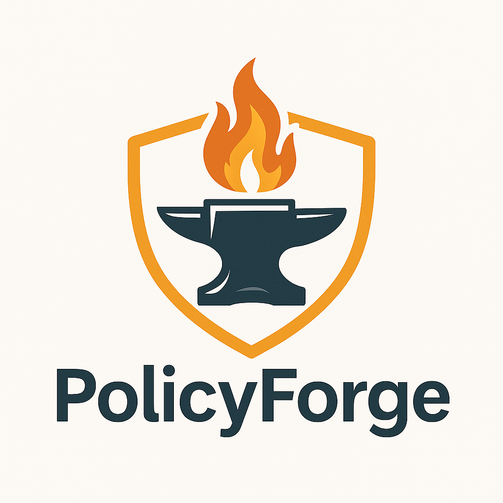

# 🛡️ PolicyForge
<p align="center">
  
</p>

**PolicyForge** is a powerful tool that helps trust & safety teams quickly generate, refine, and document moderation policies — from public-facing guidelines to internal reviewer instructions to machine-readable rules for LLMs. Available as both a CLI tool and a modern web application.

Built for clarity, consistency, and real-world enforcement.

---

## ✨ Features

- 🔍 Guided intent definition via lightweight Q&A
- 📝 Generates 3 policy types:
  - **Public-facing policy** — for your Help Center or ToS
  - **Moderator policy** — for human review teams
  - **Machine-readable policy** — structured and atomic for use with classifiers or LLMs
- 🧪 Synthetic data generation with labeled examples
- ✅ Interactive reviewer to approve or revise outputs
- 🔁 Automatic refinement based on reviewed content
- 📄 Outputs clean Markdown docs for all policy types
- 🎨 Modern web interface with real-time editing (optional)
- 📱 Responsive design for all devices
- 💻 CLI mode for quick policy generation

---

## 🚀 Getting Started

### 1. Install dependencies

```bash
# Install backend dependencies
poetry install

# For web interface, install frontend dependencies
cd src/frontend
npm install
```

### 2. Set your OpenAI API key
Create a .env file in the root directory:
```bash
OPENAI_API_KEY=sk-...
```

### 3. Choose your interface

#### CLI Mode
```bash
poetry run policyforge
```
This command will:
1. Prompt you to describe your platform and enforcement goals
2. Generate initial policies based on your intent
3. Walk you through reviewing synthetic examples
4. Refine the policy using your feedback
5. Save the final policies to Markdown

#### Web Interface
```bash
# Start the backend server (from root directory)
poetry run uvicorn src.backend.main:app --reload

# Start the frontend server (from src/frontend directory)
npm run dev
```
The web interface will be available at `http://localhost:5173`

---

## 📁 Output
Both interfaces generate the same high-quality policy documents:

#### CLI Output
Each run will generate:
* `output/<policy>_public.md` — for end users
* `output/<policy>_moderator.md` — for reviewers
* `output/<policy>_machine_policy.md` — for automation pipelines

#### Web Interface Output
Generates a zip file containing:
* `public-policy.md` — for end users
* `moderator-policy.md` — for reviewers
* `machine-policy.md` — for automation pipelines

These outputs are ready for use in:
* Product docs
* Internal playbooks
* Fine-tuning datasets
* Classifier testbeds

---

## 🧠 Philosophy
PolicyForge helps you go from ambiguous intentions to clear, enforceable, and adaptable trust & safety policies. It's built for modern content moderation — fast, transparent, and machine-compatible from the start.

---

## 👀 Coming Soon
* 🗂️ Prebuilt policy templates (harassment, nudity, misinformation, etc.)
* 📊 Dataset validation support
* 🧪 Integration with your moderation pipeline
* 🔄 Version control for policies
* 👥 Team collaboration features

---

## 💬 Questions?
Open an issue or reach out to the team. 